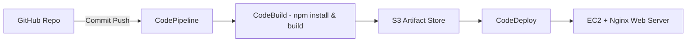

# GlobalMart-Catalog 🛒  

A CI/CD-enabled e-commerce catalog website built with **React.js**, deployed on **AWS EC2**, and automated via **CodePipeline + CodeDeploy**.  

This project is part of my DevOps portfolio, where I not only built the pipeline but also intentionally broke and troubleshooted common deployment issues — simulating real-world production firefighting as a DevOps engineer.  


## 🚀 Demo  

Visit the live demo:  
[http://your-ec2-public-ip  
](https://reactjs-ecommerce-app.vercel.app/)


## ✨ Features  

- Automated build & deploy pipeline (GitHub → CodePipeline → CodeBuild → CodeDeploy → EC2)  
- React-based responsive e-commerce frontend  
- Nginx configured to serve SPA (Single Page App) correctly  
- Real DevOps troubleshooting documented (IAM, Security Groups, CodeDeploy Agent, Webhooks)  
- Scalable AWS infrastructure design  

## 🖼️ Screenshots  


## 🛠️ Run Locally  

Clone the project  

```bash
git clone https://github.com/Eweka01/Globalmart-Catalog.git
```

Navigate into the project directory  

```bash
cd Globalmart-Catalog
```

Install dependencies  

```bash
npm install
```

Build the React app  

```bash
npm run build
```

Start development server  

```bash
npm start
```

## ⚡ Tech Stack  

- [React](https://reactjs.org/)  
- [Redux](https://redux.js.org/)  
- [Bootstrap](https://getbootstrap.com/)  
- [AWS CodePipeline](https://aws.amazon.com/codepipeline/)  
- [AWS CodeDeploy](https://aws.amazon.com/codedeploy/)  
- [Amazon EC2](https://aws.amazon.com/ec2/)  
- [Nginx](https://www.nginx.com/)  

## 🔧 CI/CD Architecture  





## 🧨 Troubleshooting Notes  

During setup, I faced and resolved several real-world issues:  

- **Webhook not triggering pipeline** → Fixed by reconnecting GitHub OAuth in CodePipeline  
- **IAM role access denied** → Attached `AWSCodeDeployFullAccess` to pipeline role  
- **Port 80 unreachable** → Updated EC2 Security Group inbound rules  
- **CodeDeploy agent missing credentials** → Attached correct IAM instance profile and restarted agent  

These failures and fixes are part of the design — practicing production troubleshooting.  


## 🤝 Contributing  

Contributions are welcome!  
- Fork this repo  
- Create a feature branch  
- Submit a PR with your changes  


## 📌 Final Result  

A fully automated CI/CD pipeline for a React-based e-commerce catalog, deployed on AWS, with documented troubleshooting of real-world DevOps challenges.  

